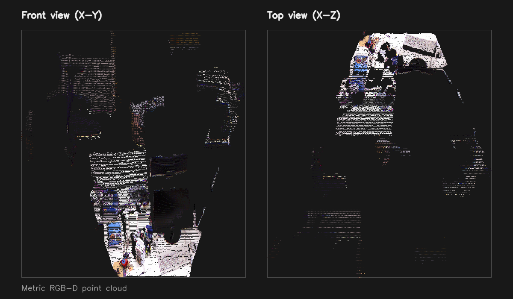

# Bootcamp-CV

Computer Vision 부트캠프 과제와 실습 결과를 정리한 저장소입니다.

## Projects

- [Week 1](./week%201): 기초 Computer Vision 실습
- [Week 2](./week2): C++/OpenCV 기반 RGB-D 2D -> 3D point cloud 변환과 GoogleTest 검증

Week 2에는 소스 코드, 7개 Unit Test, 실행 스크립트, 결과 시각화, 발표 자료와 제출용 ZIP이 포함되어 있습니다.

