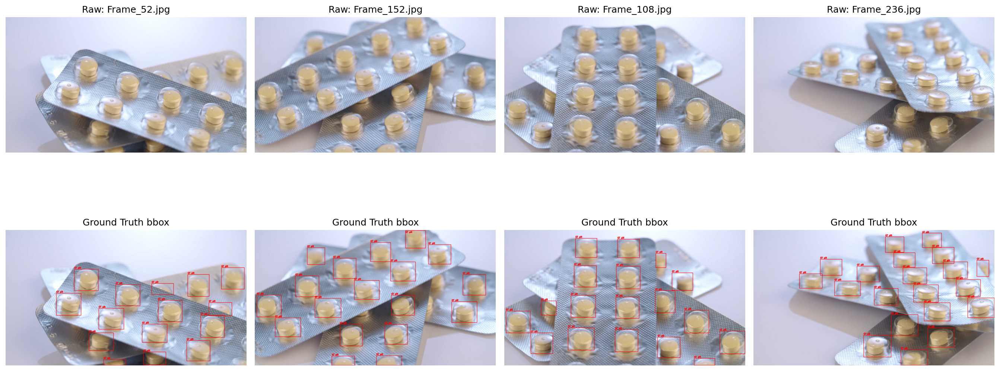
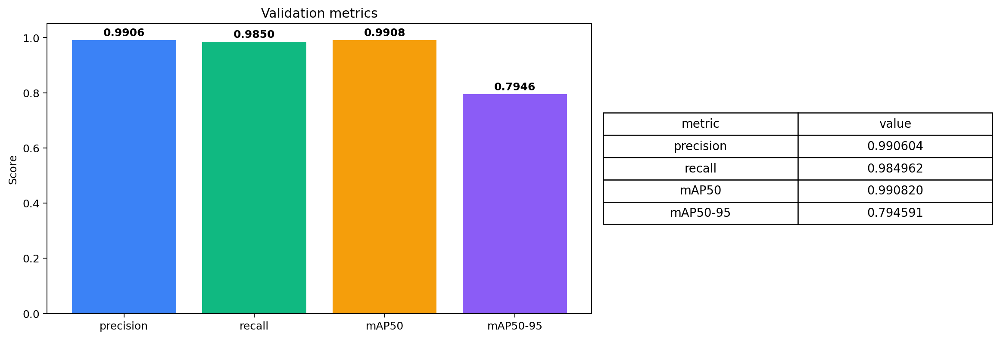
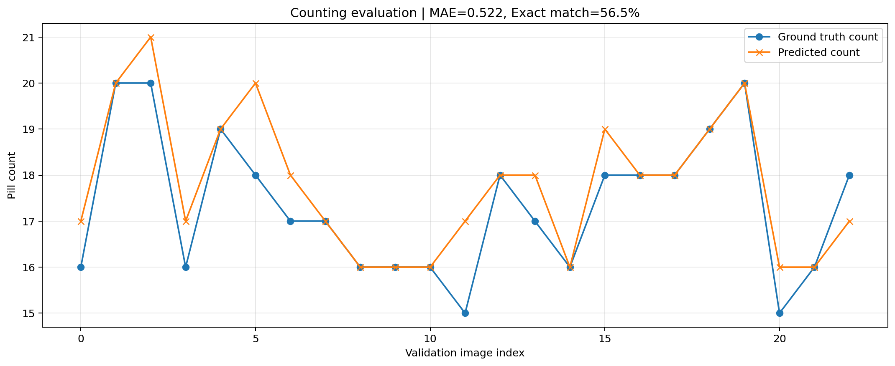
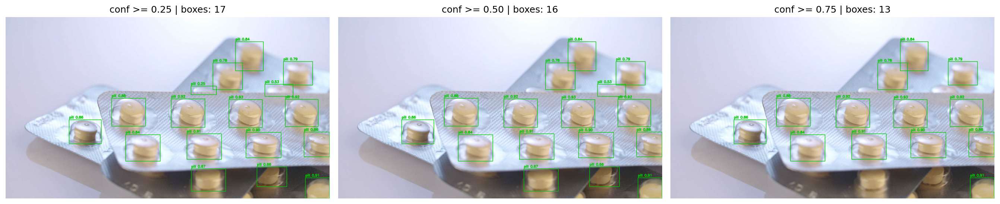
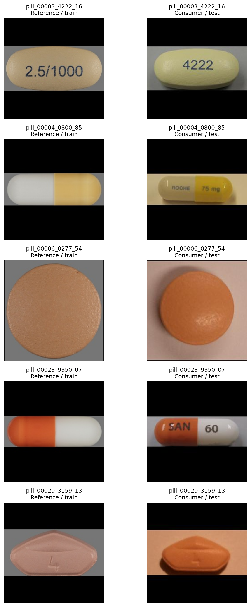
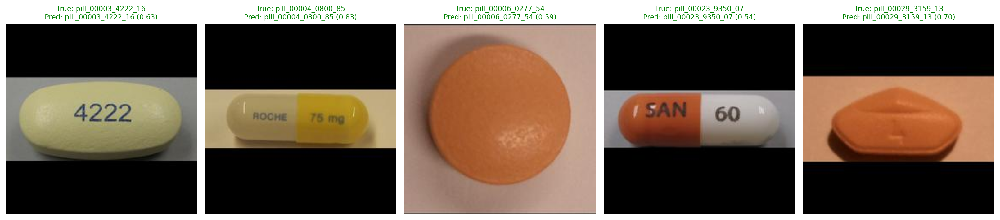
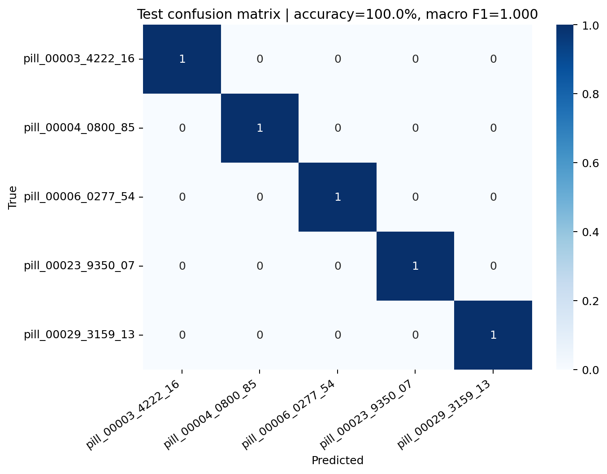
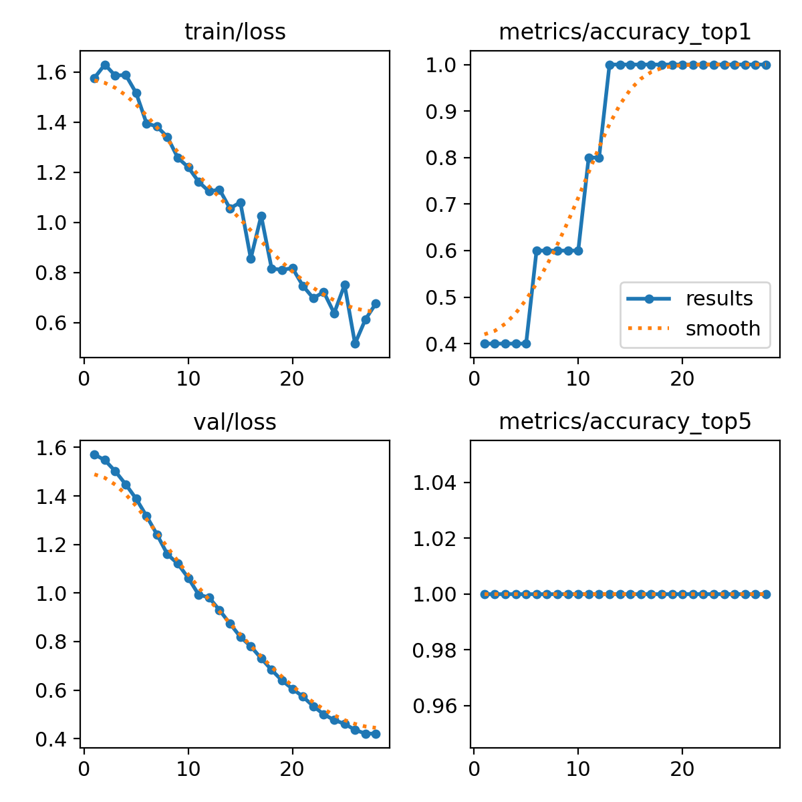

# Week 3 — YOLOv8 알약 탐지·분류 및 OpenCV 시각화

1단계에서는 사진 속 알약의 위치와 개수를 탐지하고, 2단계에서는 탐지된 알약 crop의 종류를 분류한다. 두 모델을 모두 Google Colab T4에서 실제 fine-tuning하고 결과를 시각화했다.

## 프로젝트 범위

- 데이터: [Ultralytics Medical Pills](https://docs.ultralytics.com/datasets/detect/medical-pills/)
- 규모: 학습 92장·1,623개 객체 / 검증 23장·399개 객체 / `pill` 1클래스 / 약 8.19 MB
- 모델: COCO 사전학습 `yolov8n.pt` 전이학습
- 평가: Precision, Recall, mAP50, mAP50-95
- 출력: 원본·정답 라벨, 학습 곡선, 지표 표, OpenCV 탐지 결과, threshold 비교, 이미지별 개수 평가

탐지 모델은 알약의 **위치와 개수**, 분류 모델은 선택한 5종의 **이미지 단위 종류**를 예측한다. 불량 판정이나 의료 진단은 범위가 아니다.

## 실행 방법

1. `week3_yolov8_medical_pills.ipynb`를 Google Colab에서 연다.
2. 런타임을 GPU(T4)로 설정한다.
3. 위에서부터 모든 셀을 순서대로 실행한다.
4. 마지막 셀에서 `week3_artifacts.zip`을 내려받는다.

노트북은 라이브러리 설치, 데이터 자동 다운로드, 30 epoch 학습, 검증, OpenCV 시각화, 결과 압축을 자동으로 수행한다.

분류 실험은 `week3_epillid_5class_classification.ipynb`를 별도로 열어 같은 방식으로 실행한다. 공개 ZIP에서 필요한 35장만 추출하므로 원본 전체를 저장소에 넣지 않는다.

### 원본 데이터 위치

데이터는 저장소에 포함하지 않는다. 노트북에서 Ultralytics 공식 압축 파일을 자동으로 받아 Colab의 다음 경로에 푼다.

```text
/content/datasets/medical-pills/
├── images/train  # 92장
├── images/val    # 23장
├── labels/train  # YOLO bbox 라벨
└── labels/val
```

`dataset_samples_gt.png`에는 학습 원본 4장과 라벨 파일을 좌표로 변환해 그린 Ground Truth bbox를 함께 제시했다.



## 학습 설정

| 항목 | 값 |
|---|---:|
| model | `yolov8n.pt` |
| epochs | 30 |
| image size | 640 |
| batch size | 16 |
| seed | 42 |

## 평가 지표

| 지표 | 의미 |
|---|---|
| Precision | 알약이라고 탐지한 것 중 실제 알약의 비율 |
| Recall | 실제 알약 중 모델이 찾아낸 비율 |
| mAP50 | IoU 0.50 기준 평균 정밀도 |
| mAP50-95 | IoU 0.50~0.95에서 평균한 더 엄격한 지표 |

### 실제 실행 결과

Google Colab Tesla T4에서 2026-07-18에 30 epoch를 학습했다. 학습 자체는 약 0.018시간(약 1.1분)이 걸렸고, 검증 세트 23장에 포함된 알약 399개를 기준으로 다음 결과를 얻었다.

| Precision | Recall | mAP50 | mAP50-95 |
|---:|---:|---:|---:|
| 0.9906 | 0.9850 | 0.9908 | 0.7946 |

학습 환경은 Ultralytics 8.4.100, PyTorch 2.11.0, Tesla T4였으며 상세 값은 `outputs/metrics.json`에 저장했다. 데이터가 작고 별도 테스트 세트가 없으므로 이 수치를 실제 환경에 대한 일반화 성능으로 해석하지 않는다.





### 개수 세기 업무로 확장

탐지 박스 수를 이미지별 알약 개수로 사용하고, 검증 이미지 23장의 정답 라벨 수와 비교했다. confidence 0.25에서 평균 절대 오차(MAE)는 **0.522개**, 개수가 정확히 일치한 비율은 **56.5%**였다. 높은 mAP50과 별개로, 실제 카운팅 업무에서는 threshold 조정과 오탐·미탐 분석이 더 필요하다는 뜻이다.





## OpenCV 활용

Ultralytics의 `result.plot()`을 쓰지 않고 `boxes.xyxy`와 `boxes.conf`를 꺼낸 뒤 `cv2.rectangle`, `cv2.putText`, `cv2.imwrite`로 결과를 직접 그려 저장한다.

## Detection → crop → 5종 Classification

### 데이터와 분할

분류에는 공개 [ePillID benchmark](https://github.com/usuyama/ePillID-benchmark)의 4,902종 중 외형이 서로 다른 5종을 골랐다. 각 종류는 reference 2장과 consumer 5장으로 구성되며, 작은 실습 범위에서 데이터 도메인 차이까지 볼 수 있도록 다음과 같이 나눴다.

| split | 클래스당 | 전체 | 구성 |
|---|---:|---:|---|
| train | 5장 | 25장 | reference 2 + consumer 3 |
| val | 1장 | 5장 | 미사용 consumer 1 |
| test | 1장 | 5장 | 미사용 consumer 1 |

선정 클래스는 `00003-4222-16`, `00004-0800-85`, `00006-0277-54`, `00023-9350-07`, `00029-3159-13`이다. 제품명 대신 데이터셋의 고유 pill ID를 라벨로 사용해 잘못된 의약품 명칭 해석을 피했다.



### 실제 fine-tuning 결과

ImageNet 사전학습 `yolov8n-cls.pt`를 입력 크기 224, batch 16, seed 42로 fine-tuning했다. 최대 30 epoch를 요청했으며 28 epoch에서 조기 종료되었고, best checkpoint는 13 epoch이다.

| Test Top-1 Accuracy | Macro F1 | 정답 수 | 테스트 수 |
|---:|---:|---:|---:|
| 1.000 | 1.000 | 5 | 5 |







5장을 모두 맞혔지만 confidence는 0.54~0.83이고 클래스별 테스트가 1장뿐이다. 따라서 100%라는 수치는 일반화 성능의 증거가 아니라 **작은 5종 proof-of-concept가 정상 작동했다는 실행 결과**로만 해석한다. 5개 클래스에서 Top-5 accuracy는 항상 100%이므로 평가 근거로 사용하지 않았다.

### 두 모델 연결 방식

분류 노트북의 `detect_crop_classify()`는 다음 순서로 동작한다.

1. detection 모델의 `boxes.xyxy`로 알약 위치를 찾는다.
2. 좌표를 이미지 범위로 보정하고 OpenCV로 각 알약을 crop한다.
3. crop을 classification 모델에 넣어 종류와 confidence를 얻는다.
4. `cv2.rectangle`과 `cv2.putText`로 `종류 | confidence`를 원본 이미지에 그린다.

현재 Medical Pills 탐지 데이터는 노란 알약이 다수 놓인 장면이고, ePillID 분류 데이터는 알약 한 개를 촬영한 이미지다. 즉 **코드 연결은 완성했지만 두 데이터의 촬영 도메인이 달라 end-to-end 정확도는 평가하지 않았다.** 실제 통합 모델에는 여러 종류가 함께 놓인 장면과 각 bbox의 종류 라벨이 함께 있는 동일 도메인 데이터가 필요하다.

## 한계

- 전체 115장이라 검증 지표의 변동성이 크다.
- 클래스가 하나라 알약 종류나 상태를 구분하지 못한다.
- 겹침, 작은 알약, 배경과 비슷한 색상에서는 미탐·오탐 가능성이 있다.
- 실제 적용 전에는 다양한 촬영 조건과 별도 테스트 세트가 필요하다.
- 분류 실험은 총 35장·테스트 5장이라 수치의 신뢰구간을 논할 수 없다.
- 탐지와 분류 데이터의 도메인이 달라 현재 결과만으로 통합 성능을 주장할 수 없다.
- 실제 의약품 식별은 앞·뒷면 각인, 색, 형상, 용량과 전문가 검증을 함께 사용해야 한다.

## 파일 구조

```text
week3/
├── README.md
├── requirements.txt
├── .gitignore
├── week3_yolov8_medical_pills.ipynb
├── week3_epillid_5class_classification.ipynb
├── week3_yolov8_pill_detection_report.pptx
├── week3_yolov8_pill_detection_classification_report.pptx
└── outputs/
    ├── metrics.json
    ├── counting_metrics.json
    ├── dataset_statistics.png
    ├── dataset_samples_gt.png
    ├── results.png
    ├── confusion_matrix.png
    ├── metrics_summary.png
    ├── predictions_grid.png
    ├── confidence_threshold_comparison.png
    ├── counting_evaluation.png
    ├── prediction_01.jpg
    ├── prediction_02.jpg
    ├── prediction_03.jpg
    ├── best.pt
    └── classification/
        ├── best_classifier.pt
        ├── classification_metrics.json
        ├── classification_predictions.csv
        ├── classification_dataset_samples.png
        ├── classification_test_predictions.png
        ├── classification_confusion_matrix.png
        └── classification_training_curves.png
```
