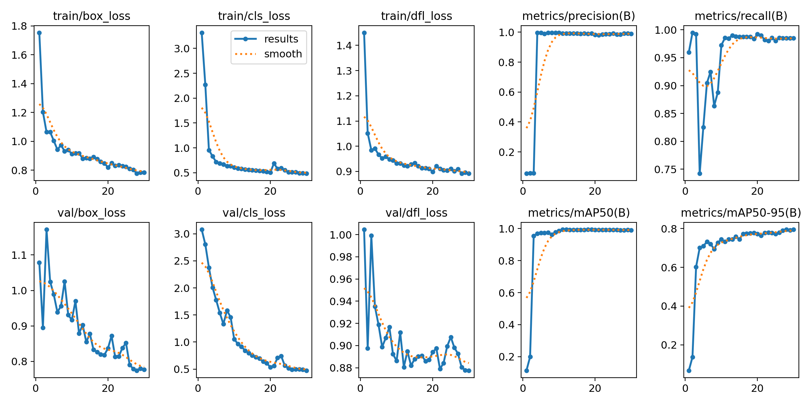
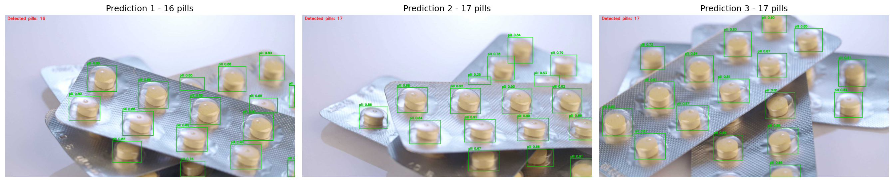

# Week 3 — YOLOv8 알약 객체 탐지 및 OpenCV 시각화

문서나 사진 속 알약의 위치를 찾도록 YOLOv8n을 학습하고, 탐지 결과를 OpenCV로 직접 시각화한다.

## 프로젝트 범위

- 데이터: [Ultralytics Medical Pills](https://docs.ultralytics.com/datasets/detect/medical-pills/)
- 규모: 학습 92장 / 검증 23장 / `pill` 1클래스 / 약 8.19 MB
- 모델: COCO 사전학습 `yolov8n.pt` 전이학습
- 평가: Precision, Recall, mAP50, mAP50-95
- 출력: OpenCV 바운딩 박스·신뢰도·검출 개수가 표시된 이미지 3장

이 결과물은 알약의 **위치와 개수**만 탐지한다. 약 종류 식별, 불량 판정, 의료 진단은 범위가 아니다.

## 실행 방법

1. `week3_yolov8_medical_pills.ipynb`를 Google Colab에서 연다.
2. 런타임을 GPU(T4)로 설정한다.
3. 위에서부터 모든 셀을 순서대로 실행한다.
4. 마지막 셀에서 `week3_artifacts.zip`을 내려받는다.

노트북은 라이브러리 설치, 데이터 자동 다운로드, 30 epoch 학습, 검증, OpenCV 시각화, 결과 압축을 자동으로 수행한다.

## 학습 설정

| 항목 | 값 |
|---|---:|
| model | `yolov8n.pt` |
| epochs | 30 |
| image size | 640 |
| batch size | 16 |
| seed | 42 |

## 평가 지표

| 지표 | 의미 |
|---|---|
| Precision | 알약이라고 탐지한 것 중 실제 알약의 비율 |
| Recall | 실제 알약 중 모델이 찾아낸 비율 |
| mAP50 | IoU 0.50 기준 평균 정밀도 |
| mAP50-95 | IoU 0.50~0.95에서 평균한 더 엄격한 지표 |

### 실제 실행 결과

Google Colab Tesla T4에서 2026-07-18에 30 epoch를 학습했다. 학습 자체는 약 0.018시간(약 1.1분)이 걸렸고, 검증 세트 23장에 포함된 알약 399개를 기준으로 다음 결과를 얻었다.

| Precision | Recall | mAP50 | mAP50-95 |
|---:|---:|---:|---:|
| 0.9906 | 0.9850 | 0.9908 | 0.7946 |

학습 환경은 Ultralytics 8.4.100, PyTorch 2.11.0, Tesla T4였으며 상세 값은 `outputs/metrics.json`에 저장했다. 데이터가 작고 별도 테스트 세트가 없으므로 이 수치를 실제 환경에 대한 일반화 성능으로 해석하지 않는다.





## OpenCV 활용

Ultralytics의 `result.plot()`을 쓰지 않고 `boxes.xyxy`와 `boxes.conf`를 꺼낸 뒤 `cv2.rectangle`, `cv2.putText`, `cv2.imwrite`로 결과를 직접 그려 저장한다.

## 한계

- 전체 115장이라 검증 지표의 변동성이 크다.
- 클래스가 하나라 알약 종류나 상태를 구분하지 못한다.
- 겹침, 작은 알약, 배경과 비슷한 색상에서는 미탐·오탐 가능성이 있다.
- 실제 적용 전에는 다양한 촬영 조건과 별도 테스트 세트가 필요하다.

## 파일 구조

```text
week3/
├── README.md
├── requirements.txt
├── .gitignore
├── week3_yolov8_medical_pills.ipynb
└── outputs/
    ├── metrics.json
    ├── results.png
    ├── confusion_matrix.png
    ├── predictions_grid.png
    ├── prediction_01.jpg
    ├── prediction_02.jpg
    ├── prediction_03.jpg
    └── best.pt
```
